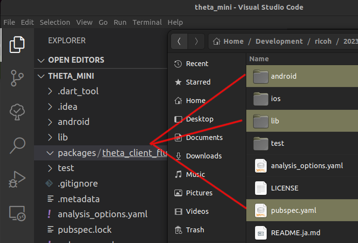
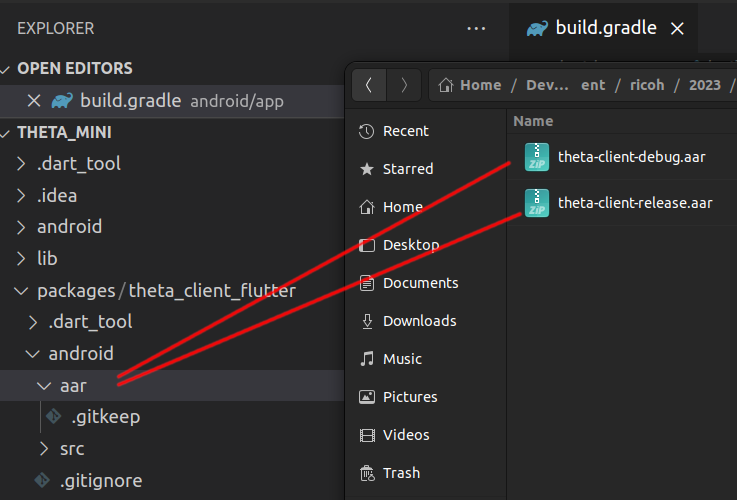
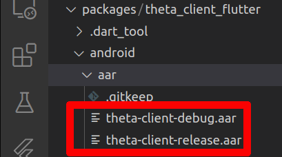
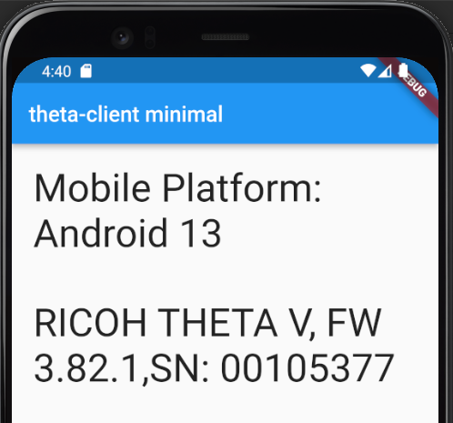

# theta_mini

Using theta-client v1.0.0.

## checkout and build theta-client 1.0.0

```text
git clone https://github.com/ricohapi/theta-client.git
cd theta-client
git tag
 1.0.0
git checkout 1.0.0
 Note: switching to '1.0.0'.
git switch -c release.1.0.0
 Switched to a new branch 'release.1.0.0'
./gradlew publishToMavenLocal
```

## create new Flutter project

The new Flutter project will use theta-client that was built in the step
above.

```text
flutter create --platforms=android -a kotlin theta_mini
Creating project theta_mini...
cd theta_mini/
mkdir packages
mkdir packages/theta_client_flutter
```

## copy theta-client package



## add theta-client to android

In `packages/theta_client_flutter/android/aar`, copy the `.aar` files
that were built in the theta-client package build step.

The aar files are in
`theta-client/kotlin-multiplatform/build/outputs`



This is what the aar files look like in VS Code.



## configure Flutter

In `pubspec.yaml`, add the theta-client package as a dependency.

```yaml
dependencies:
  flutter:
    sdk: flutter
  theta_client_flutter:
    path: ./packages/theta_client_flutter
```

## configure Android build

In `android/app/build.gradle`, make the following changes.

```groovy
if (flutterRoot == null) {
    throw new FileNotFoundException("Flutter not found. Add flutter.sdk in local.properties.")
}
...
...
defaultConfig {
    applicationId "com.oppkey.theta_mini"
    minSdkVersion 26
dependencies {
    implementation "org.jetbrains.kotlin:kotlin-stdlib-jdk7:$kotlin_version"
    implementation files('../../packages/theta_client_flutter/android/aar/theta-client-debug.aar')    
}    
```

## Test Flutter App



## Troubleshooting

If the build fails, make sure you have the `aar` files accessible in
`packages/theta_client_flutter/android/aar`

```text
Launching lib/main.dart on sdk gphone64 x86 64 in debug mode...
main.dart:1

FAILURE: Build failed with an exception.

* What went wrong:
Execution failed for task ':app:checkDebugAarMetadata'.
> Could not resolve all files for configuration ':app:debugRuntimeClasspath'.
   > Failed to transform theta-client-debug.aar to match attributes {artifactType=android-aar-metadata}.
```
